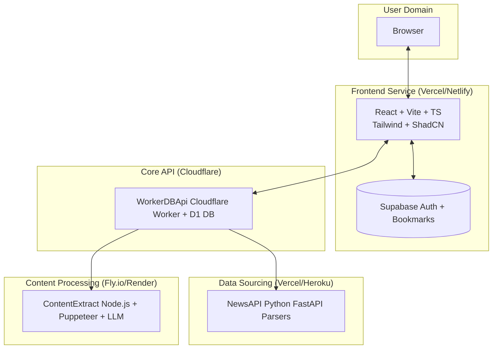
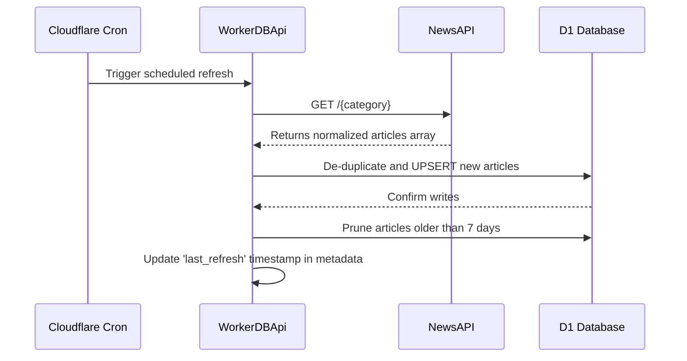
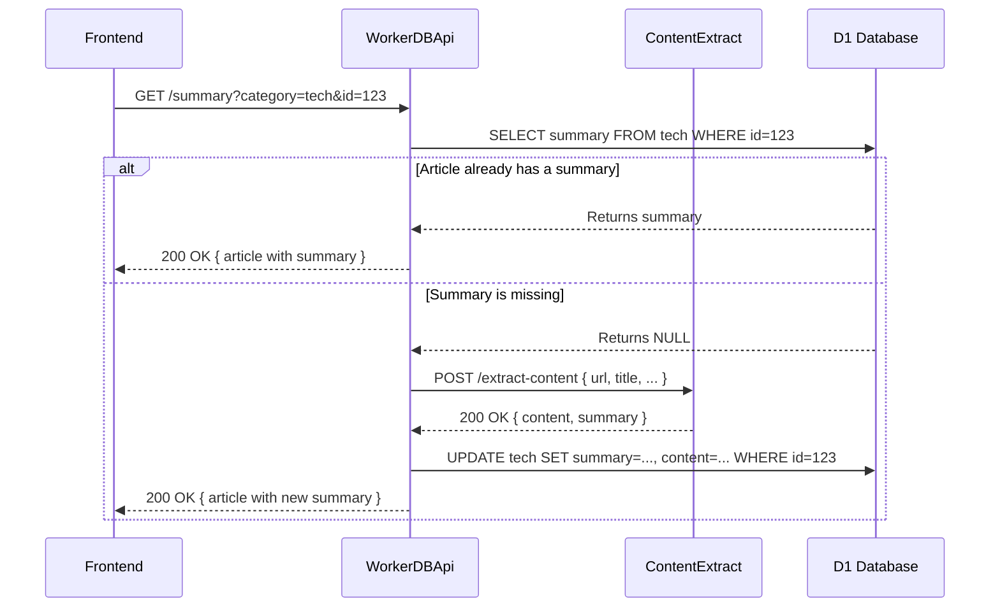

# ArcNews – Full-Stack News Dashboard
[](https://github.com/0xarchit/ArcNews-DashBoard/stargazers)
[](LICENSE)
[](https://github.com/0xarchit/ArcNews-DashBoard/issues)
[](https://github.com/0xarchit/ArcNews-DashBoard/pulls)
[](https://github.com/0xarchit/ArcNews-DashBoard)
[](https://github.com/0xarchit/ArcNews-DashBoard)
[](https://github.com/0xarchit/ArcNews-DashBoard/network/members)
[](https://github.com/0xarchit/ArcNews-DashBoard/pulls)
[](https://github.com/0xarchit/ArcNews-DashBoard)
[](https://arcnews.0xarchit.is-a.dev)

**Live Demo:** [https://arcnews.0xarchit.is-a.dev](https://arcnews.0xarchit.is-a.dev)  
**GitHub Repo:** [https://github.com/0xarchit/ArcNews-DashBoard/](https://github.com/0xarchit/ArcNews-DashBoard/)  
**Backend & Frontend Status:** [https://arcnewsapi.0xarchit.is-a.dev](https://arcnewsapi.0xarchit.is-a.dev)

---

## Table of Contents

- [Live Demo & Links](#live-demo--links)
- [⭐ Support This Project](#-support-this-project)
- [1. Overview](#1-overview)
- [2. System Architecture](#2-system-architecture)
  - [High-Level Diagram](#high-level-diagram)
  - [Data Flow: Article Ingestion (Scheduled)](#data-flow-article-ingestion-scheduled)
  - [Data Flow: Summary Enrichment (On-Demand)](#data-flow-summary-enrichment-on-demand)
- [3. Services In-Depth](#3-services-in-depth)
  - [3.1. Frontend](#31-frontend)
  - [3.2. WorkerDBApi](#32-workerdbapi)
  - [3.3. NewsAPI](#33-newsapi)
  - [3.4. ContentExtract](#34-contentextract)
- [4. Detailed API Reference](#4-detailed-api-reference)
  - [4.1. WorkerDBApi Endpoints](#41-workerdbapi-endpoints)
  - [4.2. ContentExtract Endpoints](#42-contentextract-endpoints)
  - [4.3. NewsAPI Endpoints](#43-newsapi-endpoints)
- [5. Local Development](#5-local-development)
- [6. Deployment](#6-deployment)
- [7. Future Goals](#7-future-goals)
- [8. Troubleshooting](#8-troubleshooting)
- [License](#license-©-2025-0xarchit)

## ⭐ Support This Project

If you find ArcNews useful for learning, prototyping, or as a reference, please consider starring the repository. Your support is greatly appreciated and helps the project's visibility.

---

## 1. Overview

ArcNews is a comprehensive, production-style news dashboard designed with a modular, full-stack architecture. It demonstrates the integration of multiple modern technologies to deliver a feature-rich user experience. The system is composed of four distinct, independently deployable services that work in concert:

1.  **`Frontend`**: A responsive and interactive user interface built with **Vite, React, and TypeScript**. It handles user authentication, preferences, and the presentation of news articles.
2.  **`WorkerDBApi`**: The core backend service, built on **Cloudflare Workers and the D1 database**. It serves as the primary data source for the frontend, manages data ingestion, and orchestrates calls to other backend services. It refreshes after every **1 hour** with the help of cronjobs.
3.  **`NewsAPI`**: A data-sourcing service written in **Python with FastAPI**. It is responsible for fetching and parsing news articles from various external RSS feeds and websites, normalizing the data for ingestion.
4.  **`ContentExtract`**: A specialized microservice using **Node.js and Puppeteer**. Its purpose is to extract the full, clean content from article URLs and generate concise summaries using an LLM.

This document provides a deep dive into the project's architecture, the inner workings of each service, complete API documentation, and guides for local development and deployment.

---

## 2. System Architecture

The architecture is designed for scalability and separation of concerns. The frontend is completely decoupled from the data sourcing and processing logic, communicating only with the core API worker and Supabase for user-specific data.

### High-Level Diagram

This diagram illustrates the primary components and their interactions.



**Key Principles:**

-   **Decoupled Frontend**: The `Frontend` only communicates with `WorkerDBApi` for news data and `Supabase` for authentication and bookmarks. It has no knowledge of the other backend services.
-   **Orchestration Layer**: `WorkerDBApi` acts as the central orchestrator. It handles all server-to-server communication, shielding the frontend from the complexity of data ingestion and processing.
-   **Scalable Microservices**: `NewsAPI` and `ContentExtract` are independent services that can be scaled or replaced without impacting the rest of the system.

### Data Flow: Article Ingestion (Scheduled)

This sequence shows how new articles are periodically fetched and stored.



### Data Flow: Summary Enrichment (On-Demand)

This sequence shows how an article's full content and summary are fetched the first time a user requests them.



---

## 3. Services In-Depth

### 3.1. Frontend

The frontend is a modern, single-page application providing a seamless and dynamic user experience.

-   **Directory**: `Frontend/`
-   **Tech Stack**:
    -   **Framework**: React 18 with Vite (SWC)
    -   **Language**: TypeScript
    -   **UI**: TailwindCSS with ShadCN UI components
    -   **Icons**: `lucide-react`
    -   **Data Fetching**: TanStack Query for server state, `axios`
    -   **Routing**: `react-router-dom`
    -   **Authentication & Bookmarks**: `@supabase/supabase-js`

-   **Key Features**:
    -   **User Authentication**: Secure sign-up, sign-in, and session management via Supabase Auth.
    -   **Personalized Bookmarks**: Users can save and manage their favorite articles, stored in a dedicated Supabase table.
    -   **Dynamic Dashboard**:
        -   Filter news by category (Tabs).
        -   Filter news by date range (Date Picker).
        -   Full-text search across all articles.
        -   Sort by date or popularity (likes).
    -   **Multiple Views**: Switch between responsive Grid and List layouts.
    -   **Infinite Scroll**: Smoothly loads more articles as the user scrolls.
    -   **Article Modal**: Displays the full, cleaned article content and AI-generated summary.
    -   **Robust Caching**:
        -   Category-based news data is cached in `localStorage` for 1 hour to reduce API calls.
        -   The cache implementation is resilient, automatically handling `QuotaExceededError` by evicting the oldest or largest entries to make space.
    -   **Optimistic UI Updates**: Bookmarking and liking articles provide immediate feedback while the request is in flight.
    -   **Theme Persistence**: Light, dark, and system theme support, saved to `localStorage`.

-   **Core Logic & Hooks**:
    -   `hooks/useBookmarks.ts`: A critical hook that manages bookmark state. It features a shared in-memory store with a 60-second TTL, in-flight promise de-duplication to prevent redundant fetches, and listeners to sync state across all components using the hook.
    -   `utils/api.ts`: Centralized API client for interacting with the `WorkerDBApi`. It uses the `VITE_API_BASE_URL` and includes a `fetchWithTimeout` utility.
    -   `utils/cache.ts`: Implements the robust `localStorage` caching logic with TTL and intelligent eviction.

-   **Environment Variables (`Frontend/.env`)**:
    ```env
    # The URL of your Supabase project
    VITE_SUPABASE_URL="https://<project-id>.supabase.co"

    # The public anonymous key for your Supabase project
    VITE_SUPABASE_PUBLISHABLE_KEY="<your-public-anon-key>"

    # The URL of your deployed WorkerDBApi
    VITE_API_BASE_URL="https://worker-url.workers.dev"
    ```

-   **Supabase Schema (`public.bookmarks`)**:
    ```sql
    CREATE TABLE public.bookmarks (
      id uuid PRIMARY KEY DEFAULT gen_random_uuid(),
      user_id uuid NOT NULL REFERENCES auth.users(id) ON DELETE CASCADE,
      article_id INTEGER NOT NULL,
      article_category TEXT NOT NULL,
      article_title TEXT NOT NULL,
      article_source TEXT NOT NULL,
      article_url TEXT NOT NULL,
      article_image_url TEXT,
      article_published_at TEXT NOT NULL,
      created_at TIMESTAMPTZ DEFAULT now() NOT NULL
    );

    -- Indexes for efficient querying
    CREATE INDEX idx_bookmarks_user_created ON public.bookmarks(user_id, created_at DESC);
    CREATE INDEX idx_bookmarks_user_article ON public.bookmarks(user_id, article_id, article_category);

    -- Enable Row Level Security
    ALTER TABLE public.bookmarks ENABLE ROW LEVEL SECURITY;

    -- RLS Policies
    CREATE POLICY "Users can view their own bookmarks" ON public.bookmarks
      FOR SELECT USING (auth.uid() = user_id);

    CREATE POLICY "Users can insert their own bookmarks" ON public.bookmarks
      FOR INSERT WITH CHECK (auth.uid() = user_id);

    CREATE POLICY "Users can delete their own bookmarks" ON public.bookmarks
      FOR DELETE USING (auth.uid() = user_id);
    ```

### 3.2. WorkerDBApi

This is the heart of the backend, handling data persistence, orchestration, and serving all content to the frontend.

-   **Directory**: `WorkerDBApi/`
-   **Technology**: Cloudflare Workers + D1 Database

-   **Core Responsibilities**:
    -   **Data Ingestion**: On a cron schedule (`scheduled` handler), it fetches new articles from `NewsAPI`.
    -   **Data Persistence**: Stores and manages news articles in separate D1 tables for each category.
    -   **API Gateway**: Exposes a public API for the frontend.
    -   **Service Orchestration**: Calls `ContentExtract` on-demand to enrich articles with summaries.
    -   **Business Logic**: Manages like counts and user interactions with articles.

-   **D1 Database Schema**:
    -   A separate table is created for each news category (e.g., `technology`, `sports`, etc.).
        ```sql
        CREATE TABLE technology (
          id INTEGER PRIMARY KEY,
          title TEXT,
          description TEXT,
          url TEXT UNIQUE,
          urlToImage TEXT,
          publishedAt TEXT,
          summary TEXT,
          content TEXT,
          likes INTEGER DEFAULT 0,
          liked_by TEXT -- Stores a JSON array of usernames as a string
        );
        ```
    -   A metadata table tracks system state.
        ```sql
        CREATE TABLE metadata (
          key TEXT PRIMARY KEY,
          value TEXT,
          last_refresh TEXT
        );
        ```

-   **Configuration (`wrangler.toml` and `worker.js`)**:
    -   You must bind a D1 database in `wrangler.toml`.
    -   Placeholders in `worker.js` must be replaced with your deployed service URLs:
        -   `newsApiUrl`: The base URL for your `NewsAPI` service. The worker appends the category to it (e.g., `https://my-news-api.vercel.app/technology`).
        -   `'add extract url'`: The full URL for your `ContentExtract` service's `/extract-content` endpoint.

### 3.3. NewsAPI

This service acts as the data provider, abstracting the complexity of fetching and parsing from various news sources.

-   **Directory**: `NewsAPI/`
-   **Technology**: Python 3.11+ with FastAPI

-   **Core Logic**:
    -   For each category, it maintains a list of RSS feeds or websites.
    -   It uses libraries like `feedparser` and `regex` to handle different data formats.
    -   It normalizes the extracted data into a consistent `NewsItem` schema before returning it.
    -   The provided `index.py` is a functional scaffold; the parsing logic within each function needs to be fully implemented and dependencies (`feedparser`, etc.) installed.

-   **CORS**: Configured to only allow requests from the deployed `WorkerDBApi` origin for security.

### 3.4. ContentExtract

A powerful microservice dedicated to turning a URL into clean, readable content and a summary.

-   **Directory**: `ContentExtract/`
-   **Technology**: Node.js with Express, `puppeteer-extra` (with stealth plugin), `@mozilla/readability`, and `axios`.

-   **Core Logic**:
    1.  Receives a `POST` request with a URL.
    2.  Launches a headless Chromium browser using Puppeteer. The stealth plugin helps bypass bot detection.
    3.  Intercepts network requests to block images, ads, and trackers for speed and cleanliness.
    4.  Navigates to the URL and extracts the raw HTML.
    5.  Uses Mozilla's `Readability` library to parse the HTML and extract the main article content, stripping away sidebars, headers, and other clutter.
    6.  If Readability fails, it falls back to common selectors (`main`, `article`).
    7.  The cleaned text is sent to an LLM endpoint (e.g., OpenAI-compatible API) with a prompt to summarize it.
    8.  Returns the original URL, title, description, full cleaned content, and the generated summary.

---

## 4. Detailed API Reference

### 4.1. WorkerDBApi Endpoints

This is the public API consumed by the `Frontend`.

-   **Base URL**: `https://example.workers.dev` (or your deployment)
-   **Common Headers**: `Content-Type: application/json`, `Access-Control-Allow-Origin: *`

| Method | Path                               | Description                                                                                             |
| :----- | :--------------------------------- | :------------------------------------------------------------------------------------------------------ |
| `GET`  | `/{category}`                      | Fetches all articles for a specific category, sorted by publish date.                                   |
| `GET`  | `/all`                             | Fetches articles from all categories combined, sorted by publish date (limit 10,000).                   |
| `GET`  | `/summary`                         | Fetches a single article's details, enriching it with a summary if not already present.                 |
| `GET`  | `/lastupdate`                      | Returns the timestamp of the last successful data ingestion.                                            |
| `GET`  | `/refresh`                         | Manually triggers the data ingestion process. Intended for admin use or cron jobs.                      |
| `OPTIONS` | `/*`                            | Handles CORS preflight requests.                                                                        |

---

**`GET /{category}`**

-   **Path Parameter**: `category` must be one of `business`, `entertainment`, `health`, `science`, `sports`, `technology`.
-   **Success (200)**:
    ```json
    {
      "status": "ok",
      "totalResults": 150,
      "articles": [
        {
          "id": 101,
          "source": "wired.com",
          "title": "The Future of AI",
          "description": "A look into the next decade...",
          "url": "https://www.wired.com/story/future-of-ai",
          "urlToImage": "https://...",
          "publishedAt": "2025-08-22T10:05:00.000Z",
          "summary": "",
          "content": "",
          "likes": 15,
          "liked_by": ["user1", "user2"]
        }
      ]
    }
    ```
-   **Error (500)**: If the database query fails.

---

**`GET /summary`**

-   **Query Parameters**:
    -   `category` (string, required)
    -   `id` (integer, required)
-   **Success (200)**:
    ```json
    {
      "id": 101,
      "source": "wired.com",
      "title": "The Future of AI",
      "summary": "This article explores the rapid advancements in artificial intelligence...",
      "content": "The full, cleaned text of the article...",
      "likes": 15,
      "liked_by": ["user1", "user2"]
    }
    ```
-   **Errors**:
    -   `400 Bad Request`: If `category` or `id` are missing or invalid.
    -   `404 Not Found`: If no article with that ID exists in the category.
    -   `500 Internal Server Error`: If the database or the `ContentExtract` service fails.

---

### 4.2. ContentExtract Endpoints

Server-to-server API consumed by `WorkerDBApi`.

-   **Base URL**: `http://localhost:3000` (or your deployment)

**`POST /extract-content`**

-   **Request Body**:
    ```json
    {
      "url": "https://www.wired.com/story/future-of-ai",
      "title": "The Future of AI",
      "description": "A look into the next decade..."
    }
    ```
-   **Success (200)**:
    ```json
    {
      "url": "https://www.wired.com/story/future-of-ai",
      "title": "The Future of AI",
      "description": "A look into the next decade...",
      "content": "The full, cleaned text of the article...",
      "summary": "This article explores the rapid advancements in artificial intelligence..."
    }
    ```
-   **Errors**:
    -   `400 Bad Request`: If `url` is missing or invalid.
    -   `500 Internal Server Error`: If Puppeteer or the LLM call fails.

---

### 4.3. NewsAPI Endpoints

Server-to-server API consumed by `WorkerDBApi`.

-   **Base URL**: Your deployment (e.g., on Vercel)

**`GET /{category}`**

-   **Path Parameter**: `category` (e.g., `technology`, `sports`).
-   **Success (200)**: Returns a raw JSON array of normalized article objects.
    ```json
    [
      {
        "title": "New Breakthrough in Quantum Computing",
        "link": "https://www.example.com/quantum-breakthrough",
        "pubdate": "2025-08-22T12:00:00Z",
        "description": "Scientists have announced a major leap...",
        "thumbnail_url": "https://...",
        "category": "technology"
      }
    ]
    ```

---

## 5. Local Development

### Prerequisites

-   Node.js (v18 or newer)
-   `pnpm` (for Frontend)
-   Python (v3.11 or newer)
-   Cloudflare Wrangler CLI

### Setup Instructions

1.  **Clone the repository**:
    ```sh
    git clone https://github.com/0xarchit/ArcNews-DashBoard.git
    cd ArcNews-DashBoard
    ```

2.  **Frontend**:
    ```sh
    cd Frontend
    pnpm install
    cp .env.example .env # Create .env from example
    # Fill in your VITE_SUPABASE_URL, VITE_SUPABASE_PUBLISHABLE_KEY, and VITE_API_BASE_URL
    pnpm dev
    ```

3.  **ContentExtract**:
    ```sh
    cd ContentExtract
    npm install
    npm start
    ```

4.  **NewsAPI**:
    ```sh
    cd NewsAPI
    pip install -r requirements.txt
    uvicorn api.index:app --reload
    ```

5.  **WorkerDBApi**:
    ```sh
    cd WorkerDBApi
    npm install
    # Configure wrangler.toml with your account_id and D1 binding
    # Create the D1 database: wrangler d1 create <db-name>
    # Run the schema: wrangler d1 execute <db-name> --file=./schema.sql
    # Update placeholders in worker.js to point to your local NewsAPI and ContentExtract services
    wrangler dev
    ```

---

## 6. Deployment

-   **Frontend**: Deploy to a static host like **Vercel** or **Netlify**. Set the environment variables in the project settings.
-   **WorkerDBApi**: Deploy to **Cloudflare Workers**. Create a D1 database and bind it. Set the URLs for the deployed `NewsAPI` and `ContentExtract` services as secrets.
-   **NewsAPI**: Deploy to a serverless function provider like **Vercel** or **Heroku**.
-   **ContentExtract**: Deploy to a service that supports long-running Node.js processes and can run headless Chrome, such as **Fly.io** or **Render**.

---

## 7. Future Goals

- Google One‑Tap / Social Sign‑In: add Google One‑Tap and additional OAuth providers (Apple, Twitter) for frictionless, secure sign-in and streamlined account linking.
- Enhanced performance & UX: implement server-side caching, CDN edge caching, D1 query optimizations, image lazy‑loading and HTTP/2 to reduce TTFB and improve perceived load times.
- Broader source coverage: expand NewsAPI feed lists to include more mainstream outlets, niche blogs, podcasts, and paid/partner APIs with adaptive scraping strategies and source weighting.
- Richer summarization pipeline: support configurable LLM backends, hybrid extractive+abstractive summaries, length presets, and cached summary versions to reduce costs and latency.
- Personalization & recommendations: per‑user topic preferences, collaborative filtering, session‑based ranking, and push personalization signals to deliver more relevant headlines.
- Offline & sync support: add PWA capabilities, background sync, and local read‑later queues so users can read saved articles offline.
- Real‑time updates & notifications: web push and in‑app notifications for breaking news, followed topics, and bookmark/like activity.
- Multi‑language & localization: automatic language detection, on‑the‑fly translation, localized UI strings, and right‑to‑left support where required.
- Accessibility & SEO improvements: audit and remediate WCAG issues, improve semantic markup, and enhance metadata for social previews and indexing.
- Fact‑checking & content quality signals: integrate source reliability scores, third‑party fact‑check APIs, and community reporting flows to surface trustworthy content.
- AI Chatbot Integration: Implement an AI-powered chatbot to enable users to discuss news topics, ask questions, and verify the credibility of articles using integrated fact-checking APIs and source reliability data.
- Monetization & community: non‑intrusive monetization (sponsorships, donations, premium features, non irritating ads placements), contribution guidelines, and curated editorial channels to build a community around the project.

---

## 8. Troubleshooting

-   **`QuotaExceededError` in Browser**: This is handled automatically by the frontend's cache eviction logic. If it persists, the user's `localStorage` is completely full.
-   **Bookmark Failures**: Check the browser's developer console for errors from Supabase. Ensure the user is logged in and RLS policies are correct.
-   **Missing Summaries**: Verify that the `WorkerDBApi` can reach the `ContentExtract` service. Check the worker logs for any errors.
-   **Data Not Refreshing**: Ensure the `WorkerDBApi` cron job is enabled and that it can reach the `NewsAPI` service. Check the logs for both services.

---

[License © 2025 0xArchit](LICENSE)
